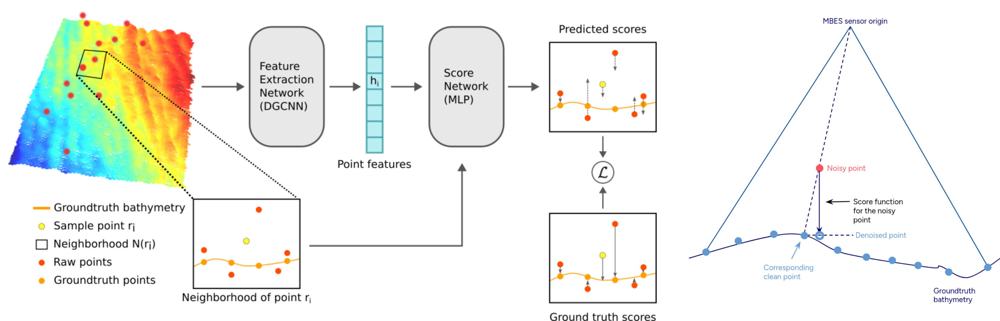

# Score-Based Multibeam Point Cloud Denoising (AUV Symposium 2024)


[Paper] [TODO]()

## Installation

### Recommended Environment

The code has been tested in the following environment:

| Package                                                      | Version | Comment                                                      |
| ------------------------------------------------------------ | ------- | ------------------------------------------------------------ |
| Python                                                       | 3.8     |                                                              |
| PyTorch                                                      | 1.9.0   |                                                              |
| [pytorch3d](https://github.com/facebookresearch/pytorch3d)   | 0.5.0   | Used to compute k nearest neighbors in the MBES point cloud. |
| Open3D                                                       | 0.18.0  | Used for baseline evaluations.                               |

### Install via Conda (PyTorch 1.9.0 + CUDA 11.1)

```bash
conda env create -f mbes_env.yml
conda activate mbes-score-denoise
```

## Datasets
To create the dataset for training, please check out the [mbes-cleaning repository](https://github.com/luxiya01/mbes-cleaning).

## Training and Evaluation
Both training and testing are performed using `train_orig_mbes.py` file. For testing, add the `--test` flag.

Example training command:
```
python train_orig_mbes.py \
       --raw_data_root <path to folder with raw data patches> \
       --gt_root <path to folder with with draping results ground truth patches>
```

Example testing command:
```
python train_orig_mbes.py \
       --raw_data_root <path to folder with raw data patches> \
       --gt_root <path to folder with with draping results ground truth patches> \
       --test \
       --ckpt_path <path to the .pt checkpoint for evaluation>
```
Please find tunable parameters in the script.

## Citation
#TODO


