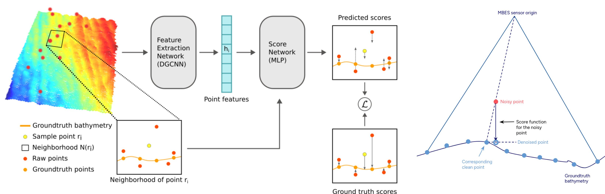

# Score-Based Multibeam Point Cloud Denoising (AUV Symposium 2024)
This repository contains the official implementation of the IEEE OES AUV Symposium 2024 paper

> [**Score-Based Multibeam Point Cloud Denoising**](https://arxiv.org/abs/2409.13143), <br>
> [Li Ling](https://www.kth.se/profile/liling), [Yiping Xie](https://xyp8023.github.io/), [Nils Bore](https://scholar.google.com/citations?user=wPea4DkAAAAJ&hl=en&oi=ao), [John Folkesson](https://www.kth.se/profile/johnf) <br>
> IEEE/OES Autonomous Underwater Vehicles Symposium (AUV), 2024

The code is based on [Score-Based Point Cloud Denoising (ICCV 2021) implementation](https://github.com/luost26/score-denoise)



## Introduction
Multibeam echo-sounder (MBES) is the de-facto sensor for seafloor mapping, or bathymetry mapping.
In recent years, cheaper MBES sensors and global mapping initiatives have led to exponential growth of available data. 
However, raw MBES point cloud data contains 1-25% of outliers, which need to be filtered out before an accurate bathymetry can be constructed.
Typically, these outliers are handled by semi-automatic cleaning algorithms such as [CUBE](https://doi.org/10.1029/2002GC000486), with extensive parameter tuning and validation by data processing experts. 
Such workflow lacks scalability and repeatability.
In this work, we draw inspirations from the point cloud denoising community, and propose a score-based multibeam denoising network. In this context, the _score_ refers to the gradient of the log-probability function of the points. The network is trained and tested using real survey data gathered by an autonomous underwater vehicle (AUV). By evaluating on unseen test data, we found that this proposed network outperforms classical methods on both outlier detection and point cloud denoising, and can be readily integrated into existing MBES standard workflows.

## Installation
We recommend using `conda` to set up the environment:

```bash
conda env create -f mbes_env.yml
conda activate mbes-score-denoise
```

The code has been tested in the following environment:

| Package                                                      | Version | Comment                                                      |
| ------------------------------------------------------------ | ------- | ------------------------------------------------------------ |
| Python                                                       | 3.8     |                                                              |
| PyTorch                                                      | 1.9.0   |                                                              |
| [pytorch3d](https://github.com/facebookresearch/pytorch3d)   | 0.5.0   | Used to compute k nearest neighbors in the MBES point cloud. |
| Open3D                                                       | 0.18.0  | Used for baseline evaluations.                               |
| CUDA | 11.1 | |

## Datasets

Due to restrictions, we are unable to release the original training data.
To create your own dataset for training, please follow the instructions provided [here](https://github.com/luxiya01/mbes-cleaning).

## Training and Evaluation
Both training and testing are performed using `train_orig_mbes.py` file.

To train a model using default hyperparameters:
```
python train_orig_mbes.py \
       --raw_data_root <path to folder with raw data patches> \
       --gt_root <path to folder with draping results ground truth patches>
```

To test a model checkpoint, add the `--test` flag and provide the checkpoint location:
```
python train_orig_mbes.py \
       --raw_data_root <path to folder with raw data patches> \
       --gt_root <path to folder with draping results ground truth patches> \
       --test \
       --ckpt_path <path to the .pt checkpoint for evaluation>
```
Please check the code for more tunable hyperparameters.

## Citation
If you find our work useful, please cite it as
```
@article{ling2024score,
  title={Score-Based Multibeam Point Cloud Denoising},
  author={Ling, Li and Xie, Yiping and Bore, Nils and Folkesson, John},
  journal={arXiv preprint arXiv:2409.13143},
  year={2024}
}
```
